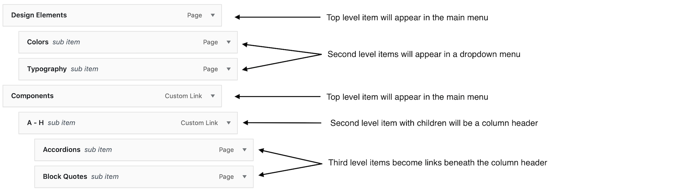
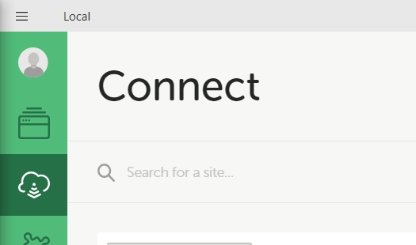
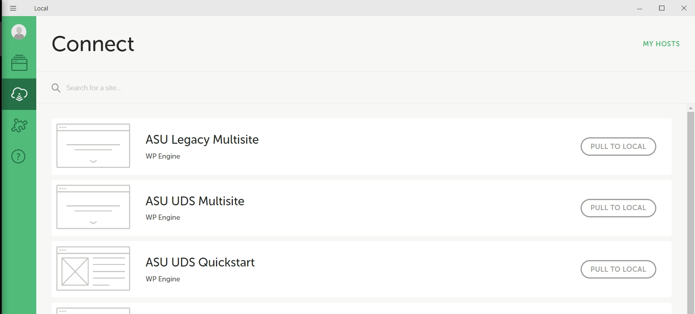

<p align="center">
  
</p>

<h1 align="center">ASU Web Standards WordPress Theme</h1>
<h2 align="center">A WordPress theme based on ASU's Web Standards 2.0</h2>

<p align="center">A WordPress theme that builds on top of ASU's canonical design tokens, and the official ASU Bootstrap theme, to deliver standards-compliant and accessible WordPress websites across ASU.</p>


[](https://getbootstrap.com/)
[](https://getbootstrap.com/)
[](https://understrap.com/)

### Features

- ASU Web Standards 2.0
  - Based on ASU's official design token libray for consistent adherence to Web Standards 2.0
  - Utilizes the official ASU Bootstrap theme built on top of the design token library
  - Accessibilty built-in: all Bootstrap markup and styling is approved by the ASU Accessibility community before release
- WordPress
  - Utilizes standard WordPress features, such as page templates, widgets, and shortcodes, for easy and rapid development of standards-compliant WordPress sites


## Table of Contents

- [Table of Contents](#table-of-contents)
- [Getting Started](#getting-started)
	- [Installation](#installation)
		- [GitHub Updater](#github-updater)
		- [Installing Required Plugins](#installing-required-plugins)
	- [Using the Theme](#using-the-theme)
		- [Updating the Theme](#updating-the-theme)
		- [Customizer Options](#customizer-options)
		- [Page Heroes](#page-heroes)
		- [Page Banners](#page-banners)
		- [Social Media Icons](#social-media-icons)
		- [Menus](#menus)
			- [Working with the Main Menu](#working-with-the-main-menu)
			- [Working with the Footer Menu](#working-with-the-footer-menu)
			- [Working with the Social Media Icons Menu](#working-with-the-social-media-icons-menu)
		- [Shortcodes](#shortcodes)
		- [Adding Sidebars](#adding-sidebars)
	- [Reporting Issues](#reporting-issues)
- [For Developers](#for-developers)
	- [Introduction](#introduction)
	- [Requirements](#requirements)
	- [Local WordPress Environment](#local-wordpress-environment)
	- [Setting Up Local or Lando](#setting-up-local-or-lando)
		- [Local By Flywheel](#local-by-flywheel)
		- [Lando](#lando)
	- [Cloning the Theme](#cloning-the-theme)
	- [Installing Dependencies](#installing-dependencies)
	- [Installing Dependencies from the ASU Unity Design System](#installing-dependencies-from-the-asu-unity-design-system)
		- [Creating a User Account and Saving your NPM Access Token](#creating-a-user-account-and-saving-your-npm-access-token)
	- [Contributing to the Theme](#contributing-to-the-theme)
		- [PHP Coding Standards](#php-coding-standards)
				- [Composer Scripts](#composer-scripts)
		- [NPM and Gulp Scripts](#npm-and-gulp-scripts)
		- [Working with Styles](#working-with-styles)
		- [BroswerSync](#broswersync)
		- [Travis CI](#travis-ci)
	- [Extending the Theme](#extending-the-theme)
		- [UDS-WordPress-Child-Theme theme template](#uds-wordpress-child-theme-theme-template)
		- [Action Hooks and Filters](#action-hooks-and-filters)
- [Project Structure](#project-structure)


## Getting Started

### Installation

#### GitHub Updater

#### Installing Required Plugins

### Using the Theme

#### Updating the Theme

#### Customizer Options

#### Page Heroes

#### Page Banners
The theme provides a widget area, and corresponding widget, for displaying UDS-compliant banners across the top of every page in your site. These banners will appear below the hero area, and above all other content.

To create a banner, add the provided *Notification Banner* widget to the *Global Banner Area* on the WordPress widgets admin screen (or via the Customizer) and configure the banner as desired using the options provided. Make sure to set the *Show Banner* option to **Yes** in order to have the banner appear on your site.

To remove a page banner, either delete the widget from the Global Banner widget area, or set the *Show Banner* option to **No**.

#### Social Media Icons

#### Menus
The UDS-WordPress theme has three assignable menu areas:
- The **main navigation** menu, at the top of every page
- The **main footer** menu, at the bottom of every page
- The **social media icons** menu, shown above the main footer area


##### Working with the Main Menu
You build the main menu of your site using the built-in WordPress menu builder. The menu-building code behind the scenes, however, will enforce certain ASU Web Standards when it comes to the main navigation menu:

- menu items can be nested no more than **three** levels deep. Any menu you item to drag to the fourth level (or any level beyond that) **will not appear** in the menu.
- First level menu items will appear as entries in the main navigation menu
- Second level menu items will form dropdown menus beneath their parent item, **unless** there are also third-level items beneath them. In that case:
  - the second level item will become a non-clickable column header, and all third-level items below it will form links in a single column
  - any sub-menu with more than two columns will be rendered as a full-width 'mega-menu'

Here is an example of a main menu hierarchy, and how each item would be rendered in this theme.



##### Working with the Footer Menu
##### Working with the Social Media Icons Menu

#### Shortcodes

#### Adding Sidebars

### Reporting Issues


## For Developers

### Introduction

### Requirements

You need to set up your development environment before you can do anything.

Install [Node.js and NPM](https://nodejs.org/en/download/)

- on OSX use [homebrew](http://brew.sh) `brew install node`
- on Windows use [chocolatey](https://chocolatey.org/) `choco install nodejs`

### Local WordPress Environment

This is a WordPress theme, and you will need to have access, and administrative rights, to a WordPress site in order to do any development on the theme. It is **not recommended** to attempt theme development on a live server.

There are several solutions available for hosting local WordPress development sites on your own computer, including:

- [Local by Flywheel](https://localwp.com/)
- [Lando](https://docs.lando.dev/)
- [wp-local-docker](https://github.com/10up/wp-local-docker) by 10up
- [VVV](https://varyingvagrantvagrants.org/)

### Setting Up Local or Lando

#### Local By Flywheel

- Visit [Local by Flywheel](https://localwp.com/) and click the `Download` button.
- Choose your platform and enter some information (only the email field is mandatory), the download should start and you’ll be taken to a start-up screen, where you will select the `Let’s Go!` button. After installation, you’ll be taken to the dashboard.
- Proceed to create a new local WordPress install or connect to a remote service like [WP Engine](https://wpengine.com/).

We are currently using WP Engine to manage our WordPress sites and to connect your Local By Flywheel installation to WP Engine you will need a WP Engine account and API key.

[WP Engine Instructions](https://wpengine.com/support/local/).
- To connect select the `Connect` icon on the left hand side of your Local dashboard.



- After you have connected to WP Engine you will see all of the site available to your account listed within the `Connect` area.


- In order to connect to WP Engine you must click the `My Hosts` button in the upper right corner of the `Connect` area.

Then you will see a list of hosting providers to choose from.

- Select `WP Engine` and sign in.

This will give you access to pull sites locally to work on.

For new project's select: `ASU UDS Quickstart`

`*` After you have pulled the site to to your local machine disconnect it from the host to ensure premature development is not deployed in the background. You can do this by clicking the same button used to `Pull To Local` to `Disconnect`.

You are now ready to clone the theme within the projects `wp-content/themes` folder.

#### Lando

- Review [Lando Requirements](https://docs.lando.dev/basics/installation.html#hardware-requirements) to check your system against the hardware requirements.
- Install [Lando](https://docs.lando.dev/basics/installation.html#macos)

Lando will install all necessary underlying dependencies to run.

Lando constructs a Docker based development environment according to YAML files called recipes that guides the containers it builds, services available and tooling provided.

Within the theme's repository is a .lando.yml file that will be used to start Lando and build the development environment.

The process will look like this.
- Change directory to project folder or make one.
- Start Lando: `$ lando start`
- Install WordPress core: `$ lando wp download core`
- Create wp-config: `$ wp config create --dbname=wordpress --dbuser=wordpress --dbpass=wordpress --dbhost=database`
- Download and import the database: `$ lando db-import site-database-export-file.sql`

You are now ready to clone the theme within the projects `wp-content/themes` folder.

### Cloning the Theme

Once you have been able to install and run a local version of WordPress, clone [theme repository](https://github.com/asu-ke-web-services/UDS-WordPress-Theme.git) into the `wp-content/themes` folder and continue with the installation process below.

### Installing Dependencies

- Make sure you have installed Node.js and Browser-Sync (optional) on your computer globally
- Then open your terminal and browse to the location of the theme
- Run: `$ composer install`
- Run: `$ npm install`

### Installing Dependencies from the ASU Unity Design System

The ASU-produced packages in this theme are loaded from the ASU Unity Private NPM (Verdaccio) package repository. This requires you to sign-in and create a user account on the NPM server. Doing so, npm will automatically save your authentication token into a local .npmrc file located in your home directory.

#### Creating a User Account and Saving your NPM Access Token

1. Visit the ASU Unity NPM Package server and follow directions to add yourself as a user: https://registry.web.asu.edu/
2. Create your npm user account by executing in a terminal: `npm adduser --registry https://registry.web.asu.edu`
3. It is recommended that you use your ASU.edu email address. You can use any password; be sure to save it in LastPass!
4. Configure npm to use this private registry. Add the following line to the .npmrc file in your home directory (existing lines can be left in-place):

```
@asu-design-system:registry=https://registry.web.asu.edu/
```

This config tells npm that all packages from ‘@asu-design-system’ should be requested from the ASU private registry. If it says you are not authorized, sign in using:

```
npm login --registry https://registry.web.asu.edu/
```

Once you have successfully signed-in, npm will automatically save a new line to your .npmrc, saving your login token for the future.

### Contributing to the Theme

Welcoming paragraph here with general contribution notes

#### PHP Coding Standards
The theme is set up with tools to help you write PHP that conforms to the [WordPress Coding Standards](https://make.wordpress.org/core/handbook/best-practices/coding-standards/php/). After initially cloning the theme repo, run `composer install` to install these tools in the `/vendor` directory.

###### Composer Scripts
The theme contains two composer scripts to help you write code that conforms to the WordPress standards:

- **`composer check:cs`** will process _all_ `.php` files in the theme and check them for compliance with the WordPress standards. Any code that does not meet the standard will be indicated, and you can fix **most** of them with another script...
- **`composer fix:cs`** will fix errors marked with an `[x]` in the output of `composer check:cs`. You will need to correct any other issues manually.

It is important to run the `composer check:cs` command and fix any issues **before pushing your code to Github**, as these commands will run on _every single .php file_ in the theme. If you don't check your work, any issues with your code will surface when another developer checks their code, making it more difficult for any developer to know if it is their code causing the errors.

If needed, you can manually run these commands and target a specific file, or files. From the **root folder** of the theme:

- To check files:`./vendor/bin/phpcs {path-to-the-php-file}`
- To fix errors: `./vendor/bin/phpcbf {path-to-the-php-file}`


#### NPM and Gulp Scripts
We use [Gulp](https://gulp.js) as our task runner. While can run Gulp tasks directly from the command line,  we have created some NPM aliases for common tasks.


- **`npm run build`** will compile theme assets from the files in the `/src` directories and copy them to `/css`, `/js`, and `/img` directories. This includes minifying CSS, uglifying and concating JS files, and running all images through `imageoptim`. If you are not using the `watch` option, this is the command to run after you have made any changes to Javascript or CSS files. This step also cleans out and replaces all files in the `\dist` directory. This is equivalent to directly running `gulp compile`.
- **`npm run images`** does only the image optimization step of the build process. It will optimize all images in `/src/img` and copying the optimized images to `/img`. This is equivalent to directly running `gulp imagemin`.
- **`npm run sync`** starts BrowserSync and watches SCSS and JS files for changes, automatically processing those files when they are saved (using a subset of the tasks that would run with `npm run build`). This is equivalent to directly running `gulp watch-bs` or just `gulp`, as it is the default Gulp task. **See the BrowserSync section below to help you set up BrowserSync before running any of these commands.**
- **`npm run assets`** will delete the files in the `/src/image`, `/src/js`, `/src/sass` and `/src/fontawesome` directories and replace them with the current files in the appropriate`/node-modules` sub-directories. This is equivalent to directly running `gulp reset-assets`. This command was formerly known as `postinstall`.
- **`npm run scripts`** will rebundle javascript files in `/src/js` based on the gulp file settings. Currently there is an admin js build, and a production js build file.

#### Working with Styles

To work with and compile your Sass files on the fly start:`$ gulp watch`

#### BroswerSync

Or, to run with Browser-Sync:

- First create a new .json file in the theme root, name it "browserSyncOptions.json", copy and paste the lines below into the new created file:

```javascript
{
    "browserSyncOptions" : {
        "proxy": "localhost/theme_test/", // <----- CHANGE HERE
        "notify": false
    },
    ...
};
```
- Change the browser-sync options to reflect your environment in the file `/browserSyncOptions.json` in the beginning of the file:
- The `proxy` property needs to match the appserver URL (created by your local server application, i.e. Lando)
- then run: `$ gulp watch-bs` or `npm run sync`

#### Travis CI

### Extending the Theme
The UDS-WordPress theme is a complete theme which includes all of the required WordPress template files and assets for the theme to work.

It can also function as the [parent](https://developer.wordpress.org/themes/advanced-topics/child-themes/#what-is-a-parent-theme) for a customized child theme. A [child theme](https://developer.wordpress.org/themes/advanced-topics/child-themes/#what-is-a-child-theme) allows developers to make modifications to any part of the existing theme and to keep their customizations separate from the parent theme functions.

The UDS-WordPress theme also includes several [action hooks](https://kinsta.com/blog/wordpress-hooks/) that can be used either by a child theme or a plugin to add or alter functionality of the parent theme.

#### UDS-WordPress-Child-Theme theme template

A "starter" child theme template has been made available for use in creating your custom solution for WordPress. That theme template is located here:

- https://github.com/asu-ke-web-services/UDS-WordPress-Child-Theme

Out of the box, the child theme template:

- Compiles its own set of CSS rules so that styles from the parent can be overwritten by the child theme's CSS.
- Includes a reference to the **UDS-Boostrap-4** design token library, so that you can include these standardized references in your child theme's codebase.
- Includes both the child and the parent's `functions.php` (and related) files. This follows the best practices of the WordPress project.

Further instructions on how to best use the child theme template can be found the GitHub repository.

#### Action Hooks and Filters

The **UDS-WordPress-Theme** includes hooks in the following places.
| Hook | Location |
|------|----------|
| uds_wp_after_global_header     | header.php         |
| uds_wp_before_global_footer     | footer.php         |
| uds_wp_before_global_footer_columns | footer.php |

**uds_wp_after_global_header** - fires immediately after the closing `</header><!-- end #asu-header -->` statement in `header.php`. Serves as an ideal place for a small banner or other alert mechanism to be added before a potential hero image across multiple pages on the site.

**uds_wp_before_global_footer** - fires immediately before the closing global `<footer>` tag in `footer.php`. Allows for a persistent block of code to appear across multiple pages of the site, just above the point at which the global footer begins.

**uds_wp_before_global_footer_columns** - fires immediately before the `<div id="wrapper-footer-columns">` landmark within `footer.php`. In conjunction with the theme option to turn off the native footer column feature, this would be a handy way to replace the native functionality for the footer columns with your own solution.

You can take advantage of these hooks within a child theme or plugin using a function like the following:
```
/**
 * Adds a section of content immediately above the global footer.
 * Looks for a template called '/templates/content-prefooter.php'
 */
function your_project_add_prefooter_content() {
	get_template_part( 'templates/content', 'prefooter' );
}
add_action( 'uds_wp_before_global_footer', 'your_project_add_prefooter_content' );
```


## Project Structure

[is this needed?]

This theme is built on top of [Understrap](https://understrap.com), with minor adjustments specific to the needs of the theme. Most traditional WordPress theme files are where you would expect them. Files and folders of interest include:

| Name                    | Description                                                                                                                                                           |
| ----------------------- | --------------------------------------------------------------------------------------------------------------------------------------------------------------------- |
| **functions.php**       | A lean file that loads code from multiple files in the **/inc** directory                                                                                             |
| **/inc**                | WordPress hooks and callbacks, organized by their purpose in the theme and loaded into **functions.php** at runtime                                                   |
| **/templates-loop**     | Partial templates for displaying content from posts and pages (the WordPress 'loop')                                                                                  |
| **/templates-page**     | Multiple full-page layout templates                                                                                                                                   |
| **/templates-sidebar**  | Templates for the various widget areas in the theme (aka 'sidebars')                                                                                                  |
| **/sass/theme/\_theme** | An SCSS file for styling rules that are not covered by the Bootstrap theme, or other SCSS files in the **/sass** directory. The first place to put your custom styles |
