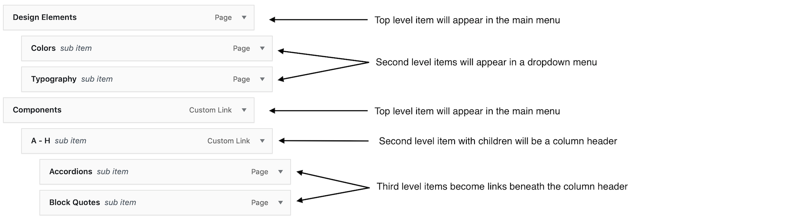

# User Guide

This guide covers how to use the UDS WordPress Theme's features and functionality.

## Table of Contents

- [Customizer Options](#customizer-options)
- [UDS Advanced Settings](#uds-advanced-settings)
- [ACF Blocks](#acf-blocks)
- [Block Patterns](#block-patterns)
- [Page Heroes](#page-heroes)
- [Page Banners](#page-banners)
- [React Footer (Footer v2)](#react-footer-footer-v2)
- [Menus](#menus)
- [Shortcodes](#shortcodes)
- [Widget Areas](#widget-areas)
- [Analytics and Tracking](#analytics-and-tracking)

## Customizer Options

The WordPress Customizer provides access to various theme settings for controlling the appearance and behavior of your site:

- **Header Settings** - Configure the ASU header including logo, navigation, and partner logo
- **Footer Settings** - Customize footer columns, social media icons, unit name, and contribute button
- **Color Schemes** - Select color options for various components
- **Analytics** - Add tracking codes for Google Tag Manager, Google Analytics, and Hotjar
- **Additional Settings** - Various other theme-specific configuration options

Access the Customizer via **Appearance → Customize** in the WordPress admin.

## UDS Advanced Settings

The theme provides an advanced settings page accessible at **WordPress Admin → Settings → UDS Advanced Settings**. This page includes configuration options for:

### React Footer Toggle
- Enable or disable the React-based footer (see [React Footer](#react-footer-footer-v2) section below for details)
- Default: Enabled for new installations

### Speculative Loading Settings
- Enable/disable WordPress 6.8+ Speculative Loading for improved performance
- Configure speculation mode (prefetch or prerender)
- Set eagerness level (conservative, moderate, or eager)
- See the [Speculative Loading guide](speculative-loading.md) for complete details

### Header Configuration
- Advanced header menu settings and customization options

## ACF Blocks

The theme includes 16 custom ACF blocks that provide UDS-compliant content components:

- **UDS Alert** - Dismissible alert messages with various styles and colors
- **UDS Background Section** - Container with background images, patterns, or colors using Inner Blocks
- **UDS Banner** - Customizable banner with text and styles
- **UDS Blockquote** - Stylized quotations with optional images and accent colors
- **UDS Button** - Configurable buttons with multiple styles, sizes, and optional icons
- **UDS Card** - Content cards with images, text, and call-to-action elements
- **UDS Content Image Overlap** - Image and content layouts with overlapping designs
- **UDS Foldable Card** - Accordion-style collapsible content cards
- **UDS Grid Links** - Grid layout for displaying linked content items
- **UDS Heading** - Customizable headings with UDS styling options
- **UDS Image** - Enhanced image block with UDS-specific features
- **UDS Modals** - Modal windows with configurable triggers and content
- **UDS Overlay Card** - Cards with image overlays and hover effects
- **UDS Person Profile** - Display profiles with photos, contact information, and social links
- **UDS Show More** - Expandable content sections with show/hide functionality
- **UDS Tabbed Panels** - Tabbed interface for organizing content into switchable panels

All blocks are available in the WordPress Block Editor under the "UDS" category and follow ASU Web Standards 2.0 design guidelines.

## Block Patterns

The theme includes 42+ pre-designed block patterns organized into categories for quick page building:

**Pattern Categories:**
- **Call to Action** - Conversion-focused layouts with buttons and messaging
- **Cards** - Various card layouts for content display (4-card, 6-card, 8-card sections)
- **Image and Text** - Combined text and image layouts in multiple configurations
- **Photo Cards** - Portrait and landscape photo card arrangements (2, 3, and 4-column layouts)
- **News and Events** - Dynamic news grid patterns
- **Page Starters** - Complete page templates (full-width, with sidebars, with breadcrumbs)
- **Quotes** - Quote layouts with various styling options
- **Video and Text** - Video content combined with text layouts
- **Miscellaneous** - Additional utility patterns including stat grids, image features, and nested containers

Access patterns from the Block Editor inserter by clicking the "Patterns" tab.

## Page Heroes

Page heroes are large banner areas at the top of pages or posts that can include images, videos, titles, and call-to-action buttons. Heroes are configured using Advanced Custom Fields on each page or post.

**Hero Configuration Options:**
- **Size** - Choose from small, medium (default), or large hero sizes
- **Media Source** - Use uploaded images, videos, or external URLs
- **Title** - Custom hero title with optional text highlighting
- **Text Color** - Choose between dark or white text for contrast
- **Call-to-Action Buttons** - Add multiple CTA buttons with configurable styles and links
- **Background Effects** - Optional color overlays and opacity controls

Heroes are automatically displayed at the top of pages and posts when configured. The hero template is located in `templates-global/hero.php`.

## Page Banners
The theme provides a widget area, and corresponding widget, for displaying UDS-compliant banners across the top of every page in your site. These banners will appear below the hero area, and above all other content.

To create a banner, add the provided *Notification Banner* widget to the *Global Banner Area* on the WordPress widgets admin screen (or via the Customizer) and configure the banner as desired using the options provided. Make sure to set the *Show Banner* option to **Yes** in order to have the banner appear on your site.

To remove a page banner, either delete the widget from the Global Banner widget area, or set the *Show Banner* option to **No**.

## React Footer (Footer v2)

The theme now includes a modern React-based footer component that operates similarly to the header, providing better performance and consistency. This feature can be toggled on or off through the WordPress admin interface.

### Enabling/Disabling the React Footer

1. Navigate to **WordPress Admin → Settings → UDS Advanced Settings**
2. Locate the **"Use React Footer"** toggle
3. Enable for the React footer (recommended) or disable to use the legacy PHP footer
4. The React footer is enabled by default for new installations

### React Footer Features

The React footer provides the same functionality as the legacy footer with these sections:
- **Branding Row**: Logo and social media icons
- **Action Row**: Contact information and footer navigation columns
- **Innovation Links**: Rankings image and university services links
- **Colophon**: Legal and compliance links

### Important Notes and Quirks

**Social Media Icons:**
- The React footer only displays [officially approved social media icons](https://zeroheight.com/9f0b32a56/p/02de7e-iconography) per ASU brand standards
- Supported platforms: Facebook, Twitter (displays as X icon), LinkedIn, Instagram, YouTube, and a few others
- **Note**: Use "Twitter" as the navigation label to get the X icon
- Icons not in the approved list will not appear in the React footer
- The icon is determined by the **Navigation Label**, not the URL
- If a social menu item has a label but no URL, the icon will not appear

**Contribute Button:**
- The button text is standardized to "Support ASU" per ASU brand guidelines
- Custom contribute button text from the Customizer is **not** used in the React footer
- This ensures brand consistency but may affect sites with custom button text
- Use the legacy footer if custom button text is required

**Footer Menu:**
- Three-level deep menus are supported, but third-level items will not display (per standards)
- If no menu is assigned to the "Footer Menu" location, the information row will still show with the site name

**Child Theme Compatibility:**
- If your child theme overrides `footer.php`, it will use that version instead of the React footer
- The React footer toggle has no effect when `footer.php` is overridden in a child theme
- This ensures child theme customizations continue to work as expected

**Customizer Settings:**
All standard Customizer settings are respected by the React footer:
- Custom logo images and URLs
- Unit name customization (custom text or site name)
- Contact link URL
- Contribute button URL
- Hiding logo/social or information rows
- Footer menu assignments

**Switching Between React and Legacy:**
- Settings are applied immediately when switching between footer types
- React footer enforces brand standards (e.g., "Support ASU" button text)
- Legacy footer allows customizations that may not meet brand standards
- No data migration is needed; both footers use the same WordPress settings

### Developer Notes

**File Structure:**
- `inc/footer-localizer-script.php` - Extracts WordPress footer data and formats it for React
- `src/js/custom/init-uds-footer.js` - Initializes the React footer component
- `footer.php` - Template that switches between React and legacy implementations
- `acf-json/group_637677713cbf6.json` - ACF field definition for the React footer toggle

**Data Flow:**
```
WordPress Customizer Settings → footer-localizer-script.php → 
JavaScript Props → React Component (AsuHeaderFooter.initASUFooter)
```

**For PHP 8.0+ Developers:**
The footer toggle logic in `footer.php` (lines 25-29) can be simplified using the null coalescing operator:
```php
$use_react_footer = get_field('use_react_footer', 'options') ?? true;
```

**Extending/Debugging:**
- JavaScript errors are logged to the browser console with descriptive messages
- Check for `udsFooterVars` in the browser console to verify footer data is being passed correctly
- The footer initialization includes checks for missing dependencies (React library, footer container, etc.)

## Menus
The UDS-WordPress theme has three assignable menu areas:
- The **main navigation** menu, at the top of every page
- The **main footer** menu, at the bottom of every page
- The **social media icons** menu, shown above the main footer area


### Working with the Main Menu
You build the main menu of your site using the built-in WordPress menu builder. The menu-building code behind the scenes, however, will enforce certain ASU Web Standards when it comes to the main navigation menu:

- menu items can be nested no more than **three** levels deep. Any menu item you drag to the fourth level (or any level beyond that) **will not appear** in the menu.
- First level menu items will appear as entries in the main navigation menu
- Second level menu items will form dropdown menus beneath their parent item, **unless** there are also third-level items beneath them. In that case:
  - the second level item will become a non-clickable column header, and all third-level items below it will form links in a single column
  - any sub-menu with more than two columns will be rendered as a full-width 'mega-menu'

Here is an example of a main menu hierarchy, and how each item would be rendered in this theme.




## Shortcodes

The theme provides the following shortcode:

### `[uds-sidebar-menu]`

Creates a collapsible sidebar navigation menu using a WordPress menu.

**Attributes:**
- `menu` - The name of the WordPress menu to display
- `title` - Optional title to display above the menu

**Example:**
```
[uds-sidebar-menu menu="My Sidebar Menu" title="Section Navigation"]
```

The shortcode generates a UDS-compliant sidebar menu with:
- Mobile-responsive collapse/expand functionality
- Bootstrap 5 data attributes for animations
- Automatic menu structure from WordPress menu builder
- ARIA labels for accessibility

## Widget Areas

The theme provides two widget areas for adding WordPress widgets:

### Global Banner Area
- **Location:** Below the hero image and above all page content
- **Purpose:** Display site-wide alert banners or important notifications
- **Widget:** Use the provided "Notification Banner" widget to create UDS-compliant banners
- **Configuration:** Add the widget in **Appearance → Widgets** or via the Customizer

### Footer Widgets
- **Location:** Additional column in the footer area
- **Purpose:** Add custom content or widgets to the footer
- **Configuration:** Add widgets in **Appearance → Widgets** or via the Customizer
- **Note:** This area is managed separately from the React Footer columns

## Analytics and Tracking

The theme includes comprehensive analytics support for tracking user interactions and behavior:

### Google Analytics Data Layer

The theme includes `data-layer.js` which automatically tracks:
- **Accordion interactions** - Open/close events on UDS Foldable Cards
- **Sidebar menu events** - Navigation clicks in sidebar menus
- **Carousel interactions** - Slide navigation events
- **Tab interactions** - Tab panel switching in UDS Tabbed Panels
- **Modal events** - Modal open/close actions
- **Button clicks** - Call-to-action button interactions
- **Card interactions** - Clicks on UDS Card elements

All events are pushed to the Google Analytics data layer with structured data including:
- Event name and type
- Action performed
- Section and region identifiers
- Clicked element text
- Custom `data-ga` attributes from blocks

### Tracking Code Integration

Configure tracking codes in the WordPress Customizer:

**Google Tag Manager**
- Add GTM container ID in Customizer
- Automatically includes both `<head>` and `<noscript>` implementations
- Provides data layer support for enhanced tracking

**Google Analytics**
- Direct GA tracking code support
- Legacy GA implementation for sites not using GTM

**Hotjar**
- Add Hotjar site ID in Customizer
- Includes Hotjar tracking script for heatmaps and session recordings

All tracking implementations follow ASU Web Standards and best practices for privacy and performance.
